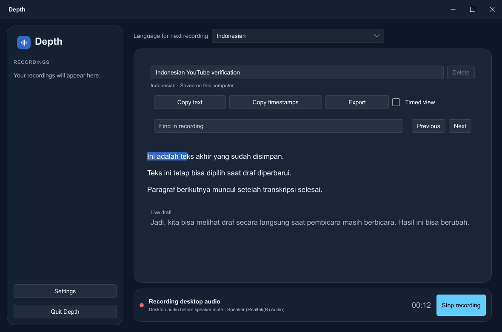
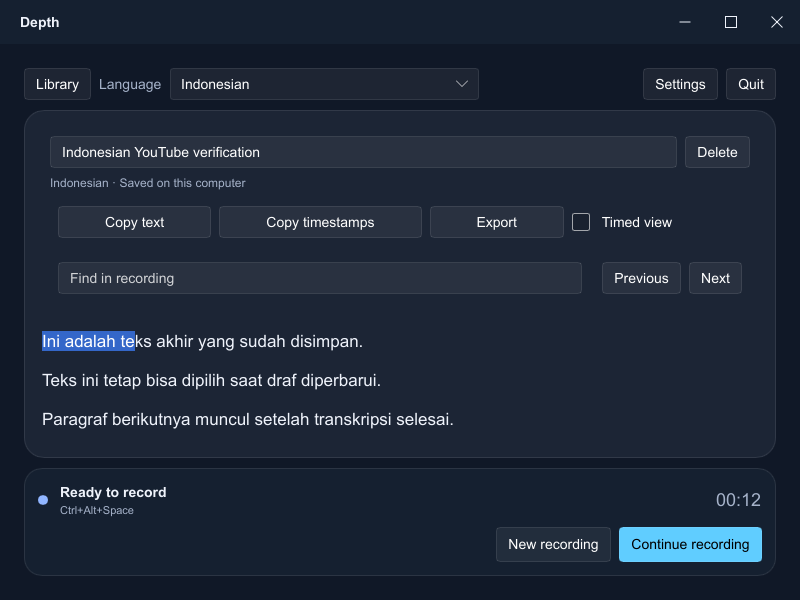
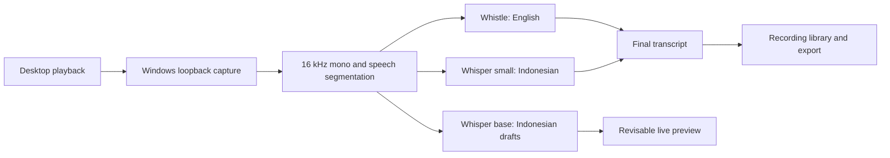

<div align="center">
  
  <h1>Depth</h1>
  <p><strong>Turn desktop audio into notes you can keep.</strong></p>
  <p>v0.1.1 &middot; Windows x64 &middot; English &amp; Indonesian &middot; On-device transcription</p>
  <p>
    <a href="#get-started">Get started</a> &middot;
    <a href="#using-depth">Using Depth</a> &middot;
    <a href="#settings">Settings</a> &middot;
    <a href="#developer-guide">Developer guide</a>
  </p>
</div>

Depth captures the audio your PC plays and turns it into a searchable recordings library. Follow a lecture, revisit a meeting, or collect notes from a video, then copy the text or export a document. Speech recognition runs locally, with no account or cloud upload.

<p align="center">
  
  <br>
  <sub>Desktop interface with sample Indonesian text. Final results and live drafts appear separately.</sub>
</p>

## What you can do

| Feature | How it helps |
| --- | --- |
| English and Indonesian | English uses Whistle; Indonesian uses Whisper with separate live-draft and final-transcription workers. |
| Live Indonesian drafts | Read revisable text while speech continues. Only final results enter saved transcripts, copy, and export. |
| A recordings library | Rename sessions, search their text, switch between paragraph and timed views, and delete recordings with confirmation. |
| Continue a recording | Append more audio to a completed session. Timestamps continue from its recorded duration, excluding time spent stopped. |
| Copy and export | Copy selected text or an entire recording, include timestamps, and export Markdown or plain text. |
| Controls wherever you work | Start or stop with `Ctrl+Alt+Space`, the tray menu, or a floating overlay with elapsed time and an Open app button. |
| Local storage and recovery | Autosave readable Markdown and recovery journals, or keep recordings in memory until you export. |
| A desktop that fits | Use System, Light, or Dark appearance, reduced motion/transparency, and a compact layout down to 800 × 600. |

Depth captures **desktop playback**. Microphone recording is not supported. It starts idle by default; recording begins when you choose Start recording or use the hotkey.

With **Windows default** selected as the audio source, supported Windows builds capture application playback before speaker mute and across output devices. On Windows builds older than 20348, Depth falls back to endpoint capture and shows a notice to keep speakers unmuted. Selecting a specific output device also uses endpoint capture, so that device's mute or volume can suppress the signal.

## Get started

This README describes the current **0.1.1 source version**. Build and package from the same checkout to include the latest changes.

### Windows installer

Check [GitHub Releases](https://github.com/Eriqo90AW/depth-ai/releases) for a packaged `depth-setup.exe`. If you already have a setup executable, run it and choose your shortcut and startup options. The NSIS installer requests administrator permission and installs into Program Files for all users. An unsigned build may show a Windows SmartScreen prompt.

Installers, downloaded models, and engine binaries are excluded from this repository. The installer scripts bundle Whistle for English, Whisper small for final Indonesian transcription, and Whisper base for Indonesian live drafts.

### Build from source

You need Windows 10 or 11 x64, PowerShell, Python 3, and Visual Studio Build Tools with the **Desktop development with C++** workload. Include the recommended CMake tools if you plan to use the optional in-process Whisper engine. The helper scripts use a Rust toolchain stored in `.toolchain/` inside this checkout.

1. Clone the repository.

   ```powershell
   git clone https://github.com/Eriqo90AW/depth-ai.git
   cd depth-ai
   ```

2. Set up the build tools and workspace-local Rust toolchain.

   <details>
   <summary>First-time build setup</summary>

   Install Visual Studio Build Tools from an administrator PowerShell, or add the C++ workload to an existing installation:

   ```powershell
   winget install --id Microsoft.VisualStudio.2022.BuildTools `
     --accept-package-agreements --accept-source-agreements `
     --override "--quiet --wait --nocache --add Microsoft.VisualStudio.Workload.VCTools --includeRecommended"
   ```

   From the repository root, install Rust into the directories expected by `scripts/dev-shell.ps1`:

   ```powershell
   $env:CARGO_HOME = Join-Path $PWD ".toolchain\cargo"
   $env:RUSTUP_HOME = Join-Path $PWD ".toolchain\rustup"
   Invoke-WebRequest https://static.rust-lang.org/rustup/dist/x86_64-pc-windows-msvc/rustup-init.exe `
     -OutFile rustup-init.exe
   .\rustup-init.exe -y --profile minimal --default-toolchain stable --no-modify-path
   ```

   </details>

3. Download the engines and models, including the Indonesian draft checkpoint.

   ```powershell
   python scripts/fetch_assets.py all --size small
   python scripts/fetch_assets.py model --size base
   ```

   The first command downloads the Whistle engine/model, the whisper.cpp runner, and Whisper small. The second adds Whisper base for live drafts. Downloads require an internet connection; transcription runs offline afterward.

4. Build, check the assets, and launch Depth.

   ```powershell
   .\scripts\dev-shell.ps1 -Command @('cargo', 'build', '--release', '--locked')
   .\target\release\depth.exe --check
   .\target\release\depth.exe
   ```

   The build helper imports Visual Studio's linker environment. `--check` reports the configuration, model paths, and available engines before you start recording.

## Using Depth

1. Open Depth and choose **English** or **Indonesian** from the language selector.
2. Play the audio you want to transcribe and click **Start recording**, or press **Ctrl+Alt+Space**.
3. Read final text as it arrives. Indonesian also shows a separate **Live draft** that can change as more speech is processed.
4. Click **Stop recording**. Depth shows **Finishing** while it processes queued final chunks, then marks the recording complete.
5. Rename the recording by editing its title and pressing Enter. Use Find, Timed view, Copy text, Copy timestamps, or Export to work with the result.
6. Select a completed recording and choose **Continue recording** to append to it, or **New recording** for a separate session.

While you read earlier text, incoming results preserve your selection and scroll position. **Jump to latest** returns to the end. Closing the window keeps Depth in the tray; use **Quit Depth** or the tray's Quit action to exit.

<p align="center">
  
  <br>
  <sub>Compact layout with sample text. The Library button opens the recordings sidebar.</sub>
</p>

New recordings save to `Documents\Depth\transcripts` by default. With autosave off, recordings remain in memory until you export them, and quitting prompts you to review unsaved work. Deleting a saved recording removes its transcript; deleting an imported legacy session removes it from the library while keeping its shared source file.

## Settings

Open **Settings** for language, desktop audio source, autosave, recording on launch, the global hotkey, appearance, floating controls, and completion notifications. Appearance changes apply immediately. Capture, engine, and autosave changes apply to the next recording. Engine and capture tuning are available under **Advanced**.

Preferences are stored in `Documents\Depth\config.toml`. These defaults match the current source:

| Key | Default | Purpose |
| --- | --- | --- |
| `language` | `"en"` | `"en"` for English, `"id"` for Indonesian. |
| `start_listening` | `false` | Start idle until recording is requested. |
| `save_transcript` | `true` | Save recordings automatically. |
| `hotkey` | `"Ctrl+Alt+Space"` | Global start/stop shortcut. |
| `viewer_theme` | `"system"` | Follow Windows appearance; also accepts `"light"` or `"dark"`. |
| `show_indicator` | `true` | Show the floating recording controls. |
| `show_result_popup` | `true` | Notify when transcription finishes. |
| `indicator_position` | `"bottom-right"` | Overlay corner; also accepts `"bottom-left"`, `"top-right"`, or `"top-left"`. |
| `whistle_model` | `"whistle.cact"` | English speech model. |
| `whisper_model` | `"ggml-small-q5_1.bin"` | Final Indonesian transcription model. |
| `whisper_draft_model` | `"ggml-base-q5_1.bin"` | Indonesian live-draft model. |
| `whisper_threads` | `0` | Allocate threads automatically for draft/final workers; a positive value applies to both. |
| `keywords` | `[]` | Names and phrases to favor during decoding. |
| `reduced_transparency` | `false` | Use a solid backdrop. |
| `reduced_motion` | `false` | Reduce interface animation. |

Omit `audio_output_device` to use **Windows default**. Selecting a specific device stores its Windows endpoint ID.

<details>
<summary>Advanced capture and engine defaults</summary>

| Key | Default | Purpose |
| --- | --- | --- |
| `vad_threshold_db` | `-45.0` | Energy threshold for opening an utterance. |
| `silence_close_ms` | `1000` | Silence that closes an utterance. |
| `max_segment_secs` | `25.0` | Maximum English chunk length. Indonesian caps this at six seconds. |
| `queue_capacity` | `8` | Final chunks buffered before the oldest is dropped. |
| `word_timestamps` | `false` | Request per-word timings from supported engines. |
| `engine_idle_unload_secs` | `120` | Unload an idle engine after this many seconds; `0` disables unloading. |
| `whistle_decoder_depth` | unset | Optional decoder depth, from 2 through 8, for the Whistle sidecar. |
| `indicator_margin` | `24` | Overlay distance from the usable screen corner, in logical pixels. |
| `indicator_opacity` | `225` | Overlay opacity, from 0 through 255. |

</details>

### Choosing Indonesian models

The asset helper supports these quantized multilingual Whisper checkpoints. Sizes are approximate download sizes, not total memory usage.

| Size | Model file | Approximate size | Use |
| --- | --- | --- | --- |
| `tiny` | `ggml-tiny-q5_1.bin` | 31 MB | Smaller final-transcription option. |
| `base` | `ggml-base-q5_1.bin` | 57 MB | Default live-draft checkpoint; can also be used for final results. |
| `small` | `ggml-small-q5_1.bin` | 181 MB | Default final-transcription checkpoint. |
| `medium` | `ggml-medium-q5_0.bin` | 539 MB | Larger final-transcription option with more CPU work. |

Download another checkpoint with `python scripts/fetch_assets.py model --size medium`, then change `whisper_model` in Advanced settings or `config.toml`. Bare model filenames are resolved against the executable, data directory, working directory, and their model/vendor locations.

Indonesian drafts are requested after two seconds of speech and every two seconds afterward. These are scheduling intervals; inference time depends on the model and CPU. Final chunks close on silence or at six seconds. A missing draft checkpoint shows a notice while final transcription continues.

## Your files

The default data directory is `Documents\Depth`:

```text
Depth/
├── config.toml                  Preferences
├── depth.log                    Diagnostics
├── scratch/                     Engine working files, including audio chunks
└── transcripts/
    ├── <recording-ID>.md         Readable final transcript
    └── .events/
        ├── <recording-ID>.jsonl  Recovery journal
        ├── titles.json          Legacy title overrides
        └── deleted.json         Removed legacy sessions
```

Each recording has a stable ID. Midnight does not split a session. Journal events are flushed as results arrive, and Markdown is updated through atomic replacement. Interrupted recordings recover intact journal events and appear as incomplete. Live drafts stay out of the saved document and journal.

Use `--home <DIR>` or the `DEPTH_HOME` environment variable to choose another data directory. The older `TRANSCRIBE_AI_HOME` variable remains supported. Autosave controls transcript storage; engines can still write scratch files and diagnostics while processing audio.

## How it works



Only the selected language's final engine runs. Indonesian adds a separate draft worker. Capture, transcription, and the interface run independently; Stop drains pending final work before the next recording starts. The default build runs prebuilt engine executables, so it does not compile whisper.cpp or link the Cactus engine in-process.

## Developer guide

### Checks and diagnostics

```powershell
.\scripts\dev-shell.ps1 -Command @('cargo', 'test', '--locked')
.\scripts\dev-shell.ps1 -Command @('cargo', 'fmt', '--check')
.\target\release\depth.exe --check

# Play desktop audio while capturing this sample.
New-Item -ItemType Directory -Force .scratch | Out-Null
.\target\release\depth.exe --record 10 .scratch\capture.wav
.\target\release\depth.exe --lang id --once .scratch\capture.wav

# Run without the desktop interface or tray.
.\target\release\depth.exe --headless
```

`--once` accepts a 16 kHz mono WAV. The diagnostic examples cover [desktop capture](examples/capture_probe.rs), [engine throughput](examples/live_benchmark.rs), [the recording pipeline](examples/pipeline_probe.rs), and [GUI snapshots](examples/gui_snapshot.rs). The screenshots in this README are rendered from the app's Slint components with sample text, rather than a live recording.

### Develop the interface

```powershell
.\scripts\dev-ui.ps1                    # Isolated app home and Slint live updates
.\scripts\dev-ui.ps1 -Preview long      # Sample document with 2,501 utterances
.\scripts\dev-ui.ps1 -Preview empty
.\scripts\dev-ui.ps1 -Preview recording
.\scripts\dev-ui.ps1 -Preview settings
.\scripts\dev-ui.ps1 -Preview error
.\scripts\dev-ui.ps1 -Software          # Software renderer
```

The helper uses `.scratch/dev` and a separate executable. Sample preview modes do not capture audio or register a hotkey. Close other Depth instances before testing real capture so hotkeys do not compete. Compatible layout edits update live; Rust changes and shared property/callback changes require restarting the app. Use an ordinary release build for packaging and responsiveness checks.

### Build options

| Cargo feature | Default | Purpose |
| --- | --- | --- |
| `whistle-sidecar` | On | English via the prebuilt Cactus `needle.exe`. |
| `whisper-sidecar` | On | Indonesian via the prebuilt `whisper-cli.exe`. |
| `tray` | On | Slint interface, tray, hotkey, and shell integration. |
| `whistle` | Off | In-process Cactus engine; requires a compatible libc++ toolchain. |
| `whisper` | Off | In-process Whisper through `whisper-rs`; requires CMake and C++ build tools. |

For an English-only desktop build:

```powershell
.\scripts\dev-shell.ps1 -Command @('cargo', 'build', '--release', '--locked', '--no-default-features', '--features', 'whistle-sidecar,tray')
```

### Packaging and artwork

The supported installer script is [installer/depth.nsi](installer/depth.nsi). With NSIS available in the workspace-local tool directory, build from the repository root:

```powershell
.\scripts\dev-shell.ps1 -Command @('cargo', 'build', '--release', '--locked')
New-Item -ItemType Directory -Force dist | Out-Null
Push-Location installer
try { ..\.toolchain\nsis\makensis.exe depth.nsi } finally { Pop-Location }
```

This produces `dist\depth-setup.exe` with Whistle, Whisper small, and Whisper base, including Indonesian live drafts. [installer/depth.iss](installer/depth.iss) is retained as an alternative/reference script; both scripts use the same output filename.

The icon assets are checked in. To regenerate them, install Pillow for Python and run `python scripts/make_icon.py`. The Rust build embeds the icon and version directly through [build/winres.rs](build/winres.rs).

## Troubleshooting

| Problem | What to check |
| --- | --- |
| `link.exe` not found | Install the Visual Studio C++ workload and build through `scripts/dev-shell.ps1`. |
| Rust toolchain missing | Run the workspace-local Rust setup above; the helper uses `.toolchain/cargo` and `.toolchain/rustup`. |
| Missing Whistle or Whisper assets | Run `python scripts/fetch_assets.py all --size small`, then `depth.exe --check`. |
| Indonesian finals work, but live drafts are unavailable | Download `python scripts/fetch_assets.py model --size base` and check `whisper_draft_model`. |
| No text appears | Check playback/player mute and routing, then select Windows default. Older Windows or a specific-device source may require unmuted speakers. The status bar reports the active source and silence guidance. |
| The hotkey does nothing | Check the registered hotkey shown in Settings and the log for a conflict with another app. |
| Music produces unwanted segments | Try a less sensitive `vad_threshold_db`, such as `-35.0`, in Advanced settings. |
| Stop shows Finishing | Final chunks are still being transcribed. Let them drain before starting another recording. |
| Development UI switches recordings slowly | Compare a compiled release build; debug and Slint live-preview builds have additional layout/rendering cost. |
| Build or installer cannot write temporary files | Point `TEMP` and `TMP` at a writable directory and retry. |
| In-process engine fails to link or build | Use the default sidecar features; optional in-process engines need additional native toolchain support. |

## Credits and licensing

The application's package metadata declares **Apache-2.0**. Speech models and engine distributions have their own license terms.

- Whistle and the needle engine are by [Cactus Compute](https://github.com/cactus-compute/needle). The asset helper downloads [Whistle](https://huggingface.co/Cactus-Compute/whistle) and [needle3](https://huggingface.co/Cactus-Compute/needle3).
- Indonesian checkpoints and the command line runner come from [whisper.cpp](https://github.com/ggml-org/whisper.cpp).
- The desktop interface is built with [Slint](https://github.com/slint-ui/slint).
